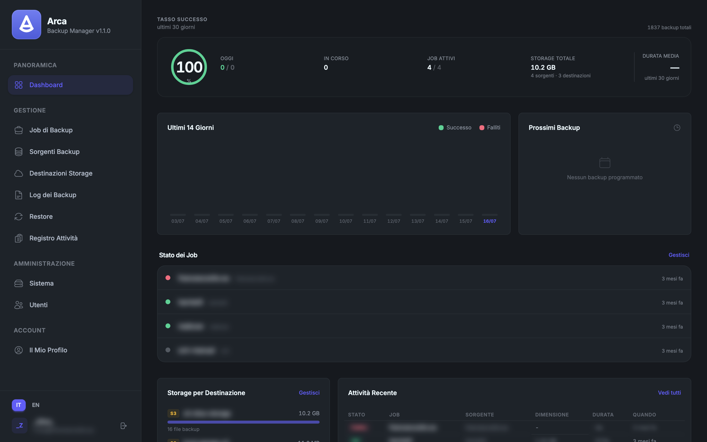
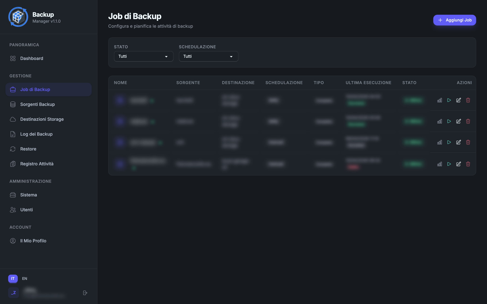
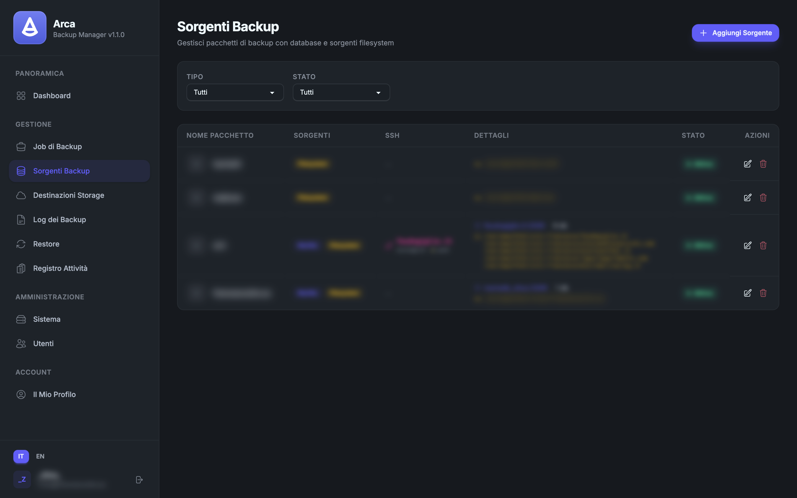
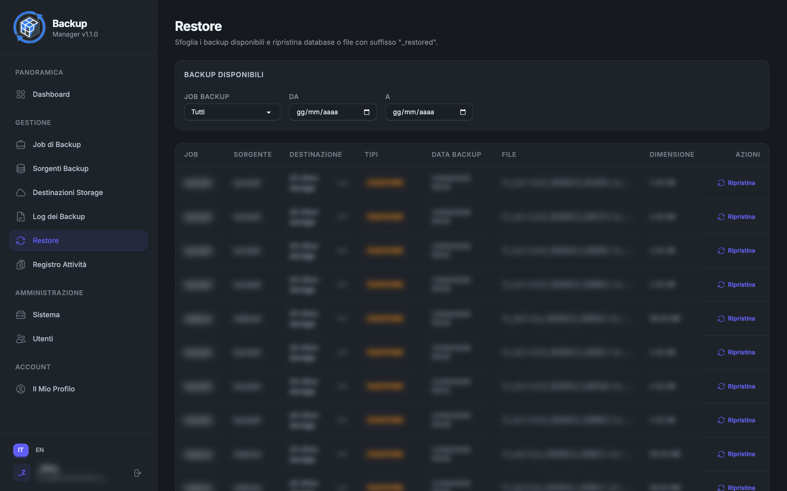
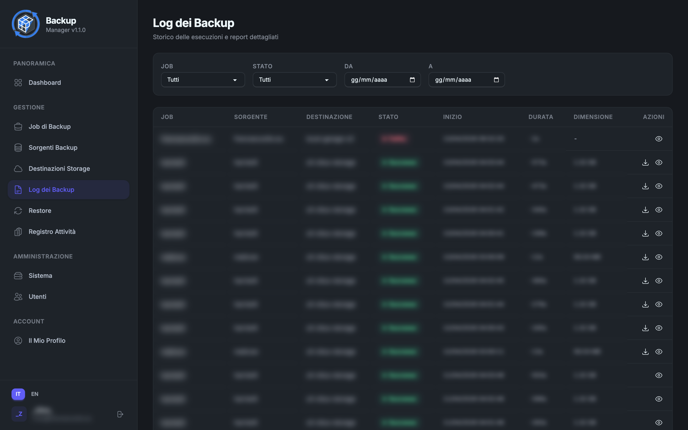
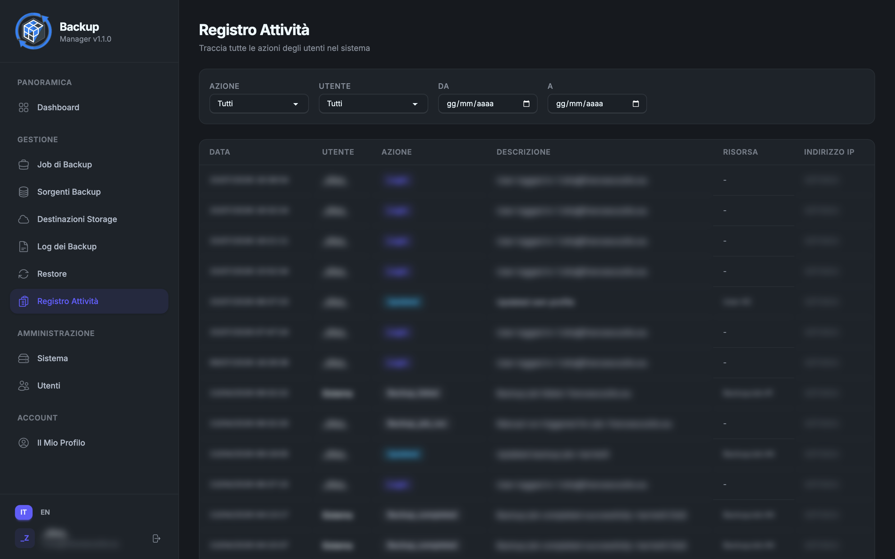

<p align="center">
  
</p>

<h1 align="center">Backup Manager</h1>

<p align="center">
  <strong>A self-hosted web application to schedule, monitor, and restore backups of MySQL, MongoDB and filesystems.</strong>
</p>

<p align="center">
  
  
  
  
  
  
  
</p>

<p align="center">
  
</p>

---

## Table of Contents

- [Overview](#-overview)
- [Features](#-features)
- [Architecture](#-architecture)
- [Requirements](#-requirements)
- [Installation](#-installation)
- [Production Setup](#-production-setup)
- [Configuration](#-configuration)
- [Usage Guide](#-usage-guide)
- [Security](#-security)
- [Testing](#-testing)
- [Project Structure](#-project-structure)
- [Screenshots](#-screenshots)
- [Changelog](#-changelog)
- [License](#-license)

---

## 🎯 Overview

**Backup Manager** is a self-hosted web application built with **Laravel 12** and **Livewire 4** that lets you configure, schedule, monitor, and restore backups of MySQL databases, MongoDB databases, and filesystem directories — from a single, clean UI.

All backup and restore operations run in the background via queued jobs. The dashboard updates in real time through **Laravel Reverb** WebSockets, so you always know exactly what is happening.

Sensitive configuration (database credentials, storage keys, SSH details) is encrypted at rest using Laravel's built-in encryption layer. Every user action is recorded in a tamper-evident audit log.

---

## ✨ Features

### Backup Sources

| Engine | Method | Notes |
|--------|--------|-------|
| **MySQL** | `mysqldump` | Single transaction, routines, triggers |
| **MongoDB** | `mongodump` | Auth support, custom collections |
| **Filesystem** | `tar` / `gzip` / `zip` | Exclude patterns, rsync over SSH |

One source can combine all three types in a single backup job.

### SSH Tunnel Support

All source types support an optional **SSH tunnel** (key or password auth via `sshpass`) so you can back up databases that are not directly reachable from the backup server.

### Incremental Backups

- **MySQL** — incremental dumps targeted only at tables modified since the last checkpoint (via `information_schema`)
- **MongoDB** — incremental dumps filtered by `ObjectId` timestamp
- **Filesystem** — only files modified after the previous run (`find -newer`)
- Configurable cadence: run a full backup every _N_ runs, incrementals in between
- Parent/child chain tracked in the database for correct restore ordering

### Storage Destinations

| Type | Notes |
|------|-------|
| **Local** | Any writable path on the backup server |
| **Amazon S3** | AWS, MinIO, DigitalOcean Spaces, Backblaze B2, or any S3-compatible endpoint |
| **FTP** | Standard FTP with optional SSL and passive mode |

Files are uploaded with streaming to avoid out-of-memory errors on large backups.

### Scheduling

- **Manual** — trigger on demand
- **Hourly / Daily / Weekly / Monthly** — simple schedule types with time-of-day and day selectors
- **Custom CRON** — any valid cron expression with a live human-readable preview
- Next run time is recalculated automatically after each execution

### Retention Policy

Each job has a configurable retention count. After every successful backup, the oldest backups exceeding the limit are deleted from remote storage and from the log database automatically.

### Restore

- **Granular selection** — restore only databases, only files, or everything from a combined backup
- **Non-destructive by default** — each database / path is restored under a new name with a `_restored_<timestamp>` suffix
- **Custom target names** — editable per database or per path before executing
- **Remote host restore** — restore MySQL or MongoDB to a different server, or push a filesystem backup to a remote host via rsync over SSH
- **Override mode** — optionally drop/overwrite an existing database or directory (requires explicit two-step confirmation with a live disclaimer showing every destructive operation)
- **Incremental chain restore** — the engine automatically resolves the full backup + all incremental steps and applies them in order
- Supported archive formats: `.sql`, `.sql.gz`, `.sql.zip`, `.tar.gz`, `.zip`

### Real-time Dashboard

- 14-day success/failure trend chart
- Active job health overview (last status, last run, next run, storage used)
- Upcoming scheduled backups
- Storage breakdown by destination
- All widgets update live via WebSocket events — no page reload required

### Audit Log

Every user-initiated action (create/update/delete of any entity, backup executions, restore executions, login, logout) is recorded with user identity, IP address, User-Agent, old values, and new values.

### Notifications

- Per-job email notification on success and/or failure
- Multiple recipient addresses per job
- Built-in test email to verify SMTP settings without running an actual backup

### Stale Job Recovery

An Artisan command (`backup:recover-stale-jobs`) runs on a schedule to automatically mark as `failed` any job that has been stuck in `running` or `pending` state for more than a configurable number of minutes (default: 70). Useful to recover from unexpected worker crashes.

### Multi-language UI

Full English and Italian translations for every label, description, validation message, and notification. Language files are scoped per component.

---

## 🏗 Architecture

```
┌───────────────────────────────────────────────────────────────┐
│                        Browser                                │
│            Livewire 4  ·  TailwindCSS  ·  DaisyUI            │
└────────────────────┬──────────────────────┬───────────────────┘
                     │ HTTP / Livewire wire  │ WebSocket
                     ▼                       ▼
        ┌────────────────────┐   ┌─────────────────────┐
        │    Laravel 12      │   │   Laravel Reverb    │
        │                    │   │  (WebSocket server) │
        │  Livewire          │   └─────────────────────┘
        │  Components        │            ▲
        │       │            │            │ broadcast
        │       │ dispatch   │            │
        │       ▼            │   BackupJobStarted / BackupJobCompleted
        │  Queue Jobs        │   RestoreJobStarted / RestoreJobCompleted
        │       │            │
        │       ▼            │
        │  Service Layer     │
        │  ┌──────────────┐  │
        │  │ Backup       │  │     ┌────────────┐  ┌────────────┐
        │  │  MySQL       │──┼────►│ mysqldump  │  │ SSH Tunnel │
        │  │  MongoDB     │──┼────►│ mongodump  │  │ (optional) │
        │  │  Filesystem  │──┼────►│ tar/rsync  │  └────────────┘
        │  └──────────────┘  │
        │  ┌──────────────┐  │     ┌────────────┐
        │  │ Storage      │  │     │ S3/FTP/    │
        │  │  S3          │──┼────►│ Local      │
        │  │  FTP         │  │     └────────────┘
        │  │  Local       │  │
        │  └──────────────┘  │
        └────────────────────┘
                  │
        ┌─────────────────────────────┐
        │  Database (SQLite / MySQL)  │
        │  BackupJob · BackupLog      │
        │  RestoreLog · AuditLog      │
        └─────────────────────────────┘
```

**Request flow:**

1. A Livewire component action (e.g., "Run now") creates a `BackupLog` record and dispatches `ProcessBackupJob` to the queue.
2. The queue worker picks up the job, runs the appropriate backup services, uploads to storage, applies retention, and broadcasts `BackupJobCompleted` via Reverb.
3. The Livewire `Dashboard` component is subscribed to the Reverb channel. On receiving the event it invalidates its computed properties, triggering a reactive re-render with fresh data — no polling, no page reload.

---

## 📦 Requirements

| Requirement | Version | Notes |
|-------------|---------|-------|
| PHP | 8.2+ | Extensions: `pdo_sqlite`, `pdo_mysql`, `mbstring`, `openssl`, `tokenizer`, `xml`, `bcmath`, `curl`, `zip` |
| Composer | 2.x | |
| Node.js | 18+ | With npm |
| SQLite | 3 | Or MySQL 8+ |
| `mysqldump` | any | Only if backing up MySQL sources |
| `mongodump` / `mongorestore` | any | Only if backing up / restoring MongoDB |
| `mongosh` | any | Only if using MongoDB override mode |
| `tar`, `gzip`, `zip` | system | For filesystem archives |
| `ssh` | system | For SSH tunnels and remote restores |
| `sshpass` | system | Only for password-based SSH auth |
| `rsync` | system | Only for remote filesystem restores |

---

## 🚀 Installation

### 1. Clone the repository

```bash
git clone https://github.com/zitus91/backup-manager.git
cd backup-manager
```

### 2. One-command setup

```bash
composer setup
```

This single command:
1. Runs `composer install`
2. Copies `.env.example` to `.env` (if not present)
3. Generates `APP_KEY`
4. Runs all database migrations
5. Seeds the admin user
6. Runs `npm install`
7. Builds frontend assets (`npm run build`)

### 3. Open the app

```
http://localhost:8000
```

**Default credentials:**

| | |
|---|---|
| Email | `admin@backup.local` |
| Password | `password` |

> **Change the password immediately** from the Profile section after first login.

### Development mode

Start all services concurrently with:

```bash
composer dev
```

This runs in parallel:
- `php artisan serve` — HTTP server on port 8000
- `php artisan queue:listen` — queue worker
- `php artisan pail` — log viewer
- `npm run dev` — Vite dev server with HMR
- `php artisan reverb:start` — WebSocket server

---

## 🖥 Production Setup

### Web server (Nginx example)

```nginx
server {
    listen 80;
    server_name backup.yourdomain.com;
    root /var/www/backup-manager/public;
    index index.php;

    location / {
        try_files $uri $uri/ /index.php?$query_string;
    }

    location ~ \.php$ {
        fastcgi_pass unix:/run/php/php8.2-fpm.sock;
        fastcgi_param SCRIPT_FILENAME $realpath_root$fastcgi_script_name;
        include fastcgi_params;
    }

    location ~ /\.(?!well-known).* {
        deny all;
    }
}
```

### Laravel scheduler (crontab)

```bash
* * * * * cd /var/www/backup-manager && php artisan schedule:run >> /dev/null 2>&1
```

The scheduler runs every minute and:
- Dispatches due backup jobs
- Runs `backup:recover-stale-jobs` to auto-recover stuck workers

### Queue worker (Supervisor)

```ini
[program:backup-manager-queue]
command=php /var/www/backup-manager/artisan queue:work --tries=1 --timeout=3600
autostart=true
autorestart=true
user=www-data
numprocs=1
redirect_stderr=true
stdout_logfile=/var/www/backup-manager/storage/logs/queue.log
stopwaitsecs=3600
```

### WebSocket server (Supervisor)

```ini
[program:backup-manager-reverb]
command=php /var/www/backup-manager/artisan reverb:start --host=0.0.0.0 --port=8080
autostart=true
autorestart=true
user=www-data
redirect_stderr=true
stdout_logfile=/var/www/backup-manager/storage/logs/reverb.log
```

### Docker

A `Dockerfile` and `docker-compose.yml` are included.

**Local development / quick start:**

```bash
docker compose up -d

# One-time initialization (first run only)
docker compose exec php-fpm php artisan key:generate
docker compose exec php-fpm php artisan migrate --force
# (optional) docker compose exec php-fpm php artisan db:seed
```

Open **http://localhost:8080**.

The default `docker-compose.yml` also starts `sqlite-web` (database browser) on port 8082 for convenience during development.

### Production Docker Deployment (Portainer)

You are using **Portainer** with persistent data volumes at `/var/www/backup`.

**Key points:**
- Code lives in `REMOTE_PATH` (example: `/var/www/backup-manager`)
- Data (storage + database) lives at `DATA_PATH=/var/www/backup`
- Use `docker-compose.prod.yml` which maps volumes correctly.

**One-time server setup:**

1. Clone the code on the server (example path):

```bash
git clone git@github.com:zitus91/backup-manager.git /var/www/backup-manager
cd /var/www/backup-manager
```

2. Create `/var/www/backup-manager/.env` **on the server** with your production values.

3. Make sure the data directories exist:

```bash
mkdir -p /var/www/backup/storage/app/public /var/www/backup/database
```

4. Initial start (you can do this from CLI or via Portainer stack):

```bash
DATA_PATH=/var/www/backup \
docker compose -f docker-compose.yml -f docker-compose.prod.yml up -d --build

DATA_PATH=/var/www/backup \
docker compose -f docker-compose.yml -f docker-compose.prod.yml exec php-fpm \
  php artisan migrate --force
```

**Normal workflow going forward:**

- `git push`
- Run the deploy script from your laptop (it does `git pull` on server + rebuild)
- If Portainer manages the stack → after the script, go to Portainer and click **Redeploy the stack** (recommended when using Portainer)

**Workflow (recommended):**

1. Make changes locally
2. `git push`
3. Run the deploy script from your machine — it will SSH to the server and do `git pull` + Docker rebuild

**Subsequent deploys (from your machine):**

```bash
cp scripts/.env.deploy.example scripts/.env.deploy
# Edit with your values (REMOTE_PATH for code, DATA_PATH=/var/www/backup)

source scripts/.env.deploy
./scripts/deploy.sh
```

The script will:
- SSH to the server
- `git pull` the latest code
- Rebuild the Docker image(s)
- Run `docker compose up -d`
- Run migrations + cache

**Because you use Portainer**, after running the script it is often best to also:
1. Open Portainer
2. Go to your stack
3. Click **Redeploy the stack**

This ensures Portainer properly tracks the new containers.

Useful one-liners:
```bash
./scripts/deploy.sh --dry-run
./scripts/deploy.sh --no-build
PORTAINER_MODE=true ./scripts/deploy.sh     # recommended with Portainer
DATA_PATH=/var/www/backup ./scripts/deploy.sh
```

**Important security notes:**
- The production `.env` (with real database credentials, storage keys, etc.) must **never** leave the server.
- `sqlite-web` is **not** started in production (`docker-compose.prod.yml` removes it).
- Consider putting a reverse proxy (Caddy, Nginx Proxy Manager, Traefik) in front of the nginx container for TLS.

See `scripts/deploy.sh` for full details and customization.

---

## ⚙️ Configuration

### Core environment variables

| Variable | Description | Default |
|----------|-------------|---------|
| `APP_KEY` | Encryption key (generated by setup) | — |
| `APP_ENV` | `local` or `production` | `local` |
| `APP_URL` | Public URL of the application | `http://localhost` |
| `DB_CONNECTION` | `sqlite` or `mysql` | `sqlite` |
| `QUEUE_CONNECTION` | `database` or `redis` | `database` |
| `BROADCAST_CONNECTION` | `reverb` or `log` | `log` |
| `MAIL_MAILER` | SMTP driver for notifications | `log` |

### Email notifications

```dotenv
MAIL_MAILER=smtp
MAIL_HOST=smtp.example.com
MAIL_PORT=587
MAIL_USERNAME=user@example.com
MAIL_PASSWORD=secret
MAIL_ENCRYPTION=tls
MAIL_FROM_ADDRESS=backup@example.com
MAIL_FROM_NAME="Backup Manager"
```

### WebSocket (real-time dashboard)

```dotenv
BROADCAST_CONNECTION=reverb

REVERB_APP_ID=backup-manager
REVERB_APP_KEY=your-reverb-key
REVERB_APP_SECRET=your-reverb-secret
REVERB_HOST=localhost
REVERB_PORT=8080
REVERB_SCHEME=http

VITE_REVERB_APP_KEY="${REVERB_APP_KEY}"
VITE_REVERB_HOST="${REVERB_HOST}"
VITE_REVERB_PORT="${REVERB_PORT}"
VITE_REVERB_SCHEME="${REVERB_SCHEME}"
```

> Without Reverb configured the application works normally — the dashboard simply will not update in real time.

---

## 🚦 Usage Guide

### 1 — Create a Backup Source

Go to **Sources** and click **New Source**. A source can include one or more of:

- **MySQL** — host, port, username, password, list of databases. Use the built-in connection test to verify and auto-discover available databases.
- **MongoDB** — host, port, credentials, list of databases. Connection test included.
- **Filesystem** — one or more directory paths with optional exclude patterns.
- **SSH Tunnel** — enable to reach sources that are not directly accessible. Supports key-based or password-based authentication.

### 2 — Create a Storage Destination

Go to **Destinations** and click **New Destination**. Choose:

- **Local** — an absolute path on the server running Backup Manager.
- **S3** — bucket, region, access key, secret key. Optionally set a custom endpoint for MinIO or other S3-compatible services.
- **FTP** — host, port, user, password, root path, SSL toggle.

A connection test button is available for all destination types.

### 3 — Create a Backup Job

Go to **Jobs** and click **New Job**:

| Setting | Description |
|---------|-------------|
| Source | Which source to back up |
| Destination | Where to upload the archive |
| Schedule | Manual / Hourly / Daily / Weekly / Monthly / Custom CRON |
| Backup type | **Full** or **Incremental** (run full every N runs) |
| Compression | None / Gzip / Zip |
| Retention | Maximum number of backup files to keep |
| Notifications | Success and/or failure emails, multiple recipients |

Click **Run Now** at any time to trigger a manual backup immediately.

### 4 — Monitor from the Dashboard

The dashboard shows:
- Global stats: active jobs, total storage used, 30-day success rate, average duration
- 14-day success/failure bar chart
- Per-job health cards with last/next run times and last status
- Upcoming scheduled backups
- Storage usage breakdown by destination

All data refreshes automatically via WebSocket when a backup starts or completes.

### 5 — Restore a Backup

Go to **Restore** and click **Restore** on any backup log entry. Configure:

1. **What to restore** — databases only, files only, or everything
2. **Target** — same host or a different remote host (MySQL / MongoDB / SSH)
3. **Target names** — customize the database name or path for each item (default: `original_restored_YYYYMMDD_HHmmss`)
4. **Override mode** — toggle to overwrite an existing database or directory (requires two-step confirmation with a live disclaimer listing every destructive operation)

For incremental backups the system automatically chains the full backup with all subsequent incrementals and applies them in the correct order.

---

## 🔒 Security

- **Encrypted credentials** — all sensitive configuration (database passwords, S3 keys, SSH keys/passwords, remote host configs) is stored using Laravel's `encrypted:array` cast, which uses AES-256-CBC encryption tied to `APP_KEY`. Guard your `.env` file carefully.
- **Audit log** — every user action is recorded with IP, User-Agent, and before/after values. The audit log cannot be deleted from the UI.
- **Non-destructive restores** — restores default to a new name with a timestamp suffix. Override mode (which can drop databases or delete directories) requires explicit opt-in and a two-step confirmation with a prominent warning.
- **Authentication** — all backup management routes require authentication. There is no guest or API access.
- **Input validation** — all Livewire component inputs are validated server-side before any operation is executed.

---

## 🧪 Testing

```bash
# Run the full test suite
composer test

# Run with Pest directly
php artisan test

# Test coverage report
php artisan test --coverage
```

Tests use **Pest 3.8** with `RefreshDatabase`, an in-memory SQLite database, and array drivers for cache, session, and queue. Services are mocked; actual external tools (`mysqldump`, `mongodump`, etc.) are never invoked during tests.

Feature tests live in `tests/Feature/Backup/`.

---

## 📁 Project Structure

```
backup-manager/
├── app/
│   ├── Console/Commands/
│   │   └── RecoverStaleBackupJobs.php       # Auto-recover stuck jobs
│   ├── Events/
│   │   ├── Backup/                          # BackupJobStarted, BackupJobCompleted
│   │   └── Restore/                         # RestoreJobStarted, RestoreJobCompleted
│   ├── Http/Controllers/
│   │   └── BackupLogDownloadController.php  # Streaming file download
│   ├── Jobs/
│   │   ├── Backup/ProcessBackupJob.php      # Queued backup orchestrator
│   │   └── Restore/ProcessRestoreJob.php    # Queued restore orchestrator
│   ├── Livewire/
│   │   ├── Admin/    # UserIndex, UserForm, Profile
│   │   ├── Auth/     # Login
│   │   └── Backup/   # Dashboard, BackupJobIndex/Form, BackupLogIndex,
│   │                 # BackupSourceIndex/Form, StorageDestinationIndex/Form,
│   │                 # RestoreIndex, AuditLogIndex
│   ├── Mail/
│   │   ├── BackupNotificationMail.php
│   │   └── BackupTestMail.php
│   ├── Models/
│   │   ├── BackupJob.php
│   │   ├── BackupLog.php
│   │   ├── BackupSource.php
│   │   ├── BackupStorageDestination.php
│   │   ├── RestoreLog.php
│   │   ├── AuditLog.php
│   │   └── User.php
│   ├── Services/
│   │   ├── Backup/
│   │   │   ├── MysqlBackupService.php
│   │   │   ├── MongodbBackupService.php
│   │   │   ├── FilesystemBackupService.php
│   │   │   ├── S3StorageService.php
│   │   │   ├── FtpStorageService.php
│   │   │   ├── BackupSchedulerService.php
│   │   │   └── SshTunnelService.php
│   │   └── Restore/
│   │       ├── MysqlRestoreService.php
│   │       ├── MongodbRestoreService.php
│   │       └── FilesystemRestoreService.php
│   └── Trait/
│       └── HasCache.php                     # Tag-based caching for all models
├── database/
│   ├── factories/
│   ├── migrations/
│   └── seeders/
├── lang/
│   ├── en/   # English translations (scoped per component)
│   └── it/   # Italian translations
├── resources/
│   ├── css/
│   ├── js/
│   └── views/
│       ├── components/layouts/  # admin.blade.php, guest.blade.php
│       ├── mail/
│       └── livewire/
├── routes/
│   ├── channels.php    # Reverb broadcast channel definitions
│   ├── console.php     # Artisan scheduler
│   └── web.php         # All HTTP routes (prefix: /admin/backup/)
└── tests/
    ├── Feature/Backup/
    └── Unit/
```

---

## 📸 Screenshots

| Dashboard | Backup Jobs |
|:---------:|:-----------:|
|  |  |

| Sources | Restore |
|:-------:|:-------:|
|  |  |

| Logs | Audit |
|:----:|:-----:|
|  |  |

---

## 📋 Changelog

See [CHANGELOG.md](CHANGELOG.md) for the full release history.

---

## 📄 License

Released under the [MIT License](LICENSE).

---

<p align="center">
  Built with ❤️ using <a href="https://laravel.com">Laravel</a>, <a href="https://livewire.laravel.com">Livewire</a> and <a href="https://daisyui.com">DaisyUI</a>
</p>
